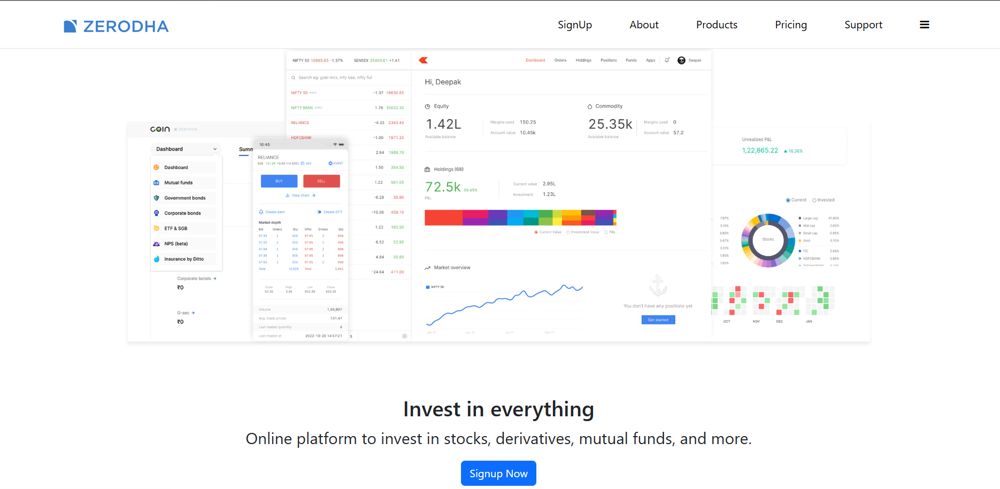
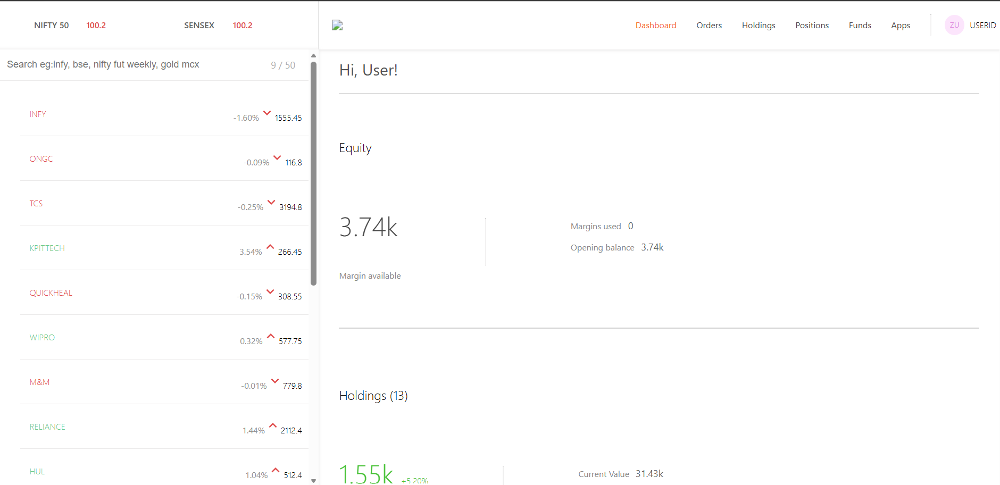
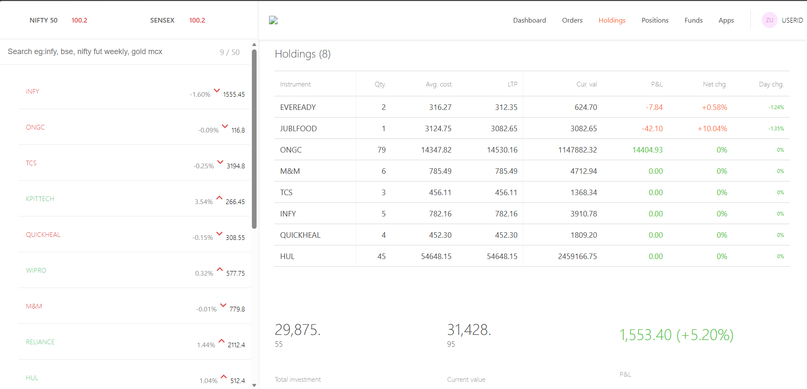
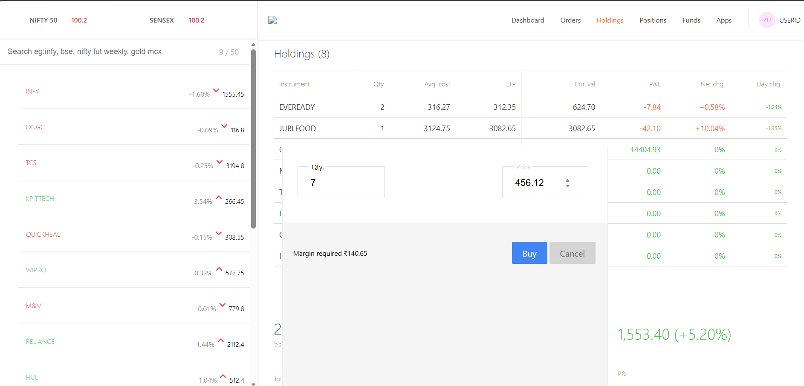

# 🚀 Zerodha Clone - Full Stack MERN Trading Platform

A full-stack clone of the Zerodha trading platform built using the MERN Stack. This project replicates the core functionality of a stock trading application, including portfolio management, holdings, positions, order placement, and an interactive dashboard.

## 🌐 Live Demo

### Landing Page
https://zerodha-frontend-e72m.onrender.com/

### Trading Dashboard
https://zerodha-dashboard-mvzs.onrender.com/

### Backend API
https://zerodha-clone-qwrf.onrender.com/

---

# 📌 Features

## Landing Website

- Responsive landing page
- Home
- Products
- Pricing
- Support
- About
- Navigation to Dashboard

## Trading Dashboard

- Portfolio Overview
- Holdings
- Positions
- Orders
- Interactive Charts
- Buy Stock functionality
- Dynamic portfolio updates
- Real-time data fetched from MongoDB

## Backend

- RESTful API
- MongoDB Atlas integration
- Order Management
- Holdings Management
- Positions Management
- CORS enabled
- Express.js server

---

# 🛠️ Tech Stack

## Frontend

- React.js
- React Router
- Axios
- CSS
- HTML5

## Dashboard

- React.js
- Material UI
- Chart.js
- React ChartJS 2
- Axios

## Backend

- Node.js
- Express.js
- MongoDB Atlas
- Mongoose
- Body Parser
- CORS
- dotenv

## Deployment

- Render (Frontend)
- Render (Dashboard)
- Render (Backend)
- MongoDB Atlas

---

# 📂 Project Structure

```
Zerodha Clone
│
├── backend
│   ├── model
│   ├── schemas
│   ├── index.js
│   └── package.json
│
├── dashboard
│   ├── src
│   ├── public
│   └── package.json
│
├── frontend
│   ├── src
│   ├── public
│   └── package.json
│
└── README.md
```

---

# ⚙️ Installation

## Clone the repository

```bash
git clone https://github.com/aashirajpoot/Zerodha-Clone.git
```

Move into the project directory

```bash
cd Zerodha-Clone
```

---

# Backend Setup

```bash
cd backend
npm install
```

Create a `.env` file

```env
MONGO_URL=your_mongodb_connection_string
PORT=3001
```

Start the backend

```bash
npm start
```

---

# Frontend Setup

```bash
cd frontend
npm install
npm start
```

---

# Dashboard Setup

```bash
cd dashboard
npm install
npm start
```

---

# API Endpoints

## Holdings

```
GET /allHoldings
```

Returns all holdings.

---

## Positions

```
GET /allPositions
```

Returns all positions.

---

## Orders

```
GET /allOrders
```

Returns all placed orders.

---

## Buy Order

```
POST /newOrder
```

Request Body

```json
{
  "name": "TCS",
  "qty": 5,
  "price": 3500,
  "mode": "BUY"
}
```

---

# Database

MongoDB Atlas is used for storing

- Holdings
- Positions
- Orders

---

# Screenshots

<h2>Landing Page</h2>

<p align="center">
  
</p>

<h2>Dashboard</h2>

<p align="center">
  
</p>

<h2>Holdings</h2>

<p align="center">
  
</p>

<h2>Buy Order Window</h2>

<p align="center">
  
</p>

# Future Improvements

- User Authentication
- JWT Authorization
- Sell Order functionality
- Live Stock Market API Integration
- Real-time Stock Prices
- Portfolio Analytics
- Watchlist
- Dark Mode
- Order History
- User Profiles

---

# Learning Outcomes

This project helped in understanding

- Full Stack MERN Development
- REST API Development
- MongoDB Atlas
- Mongoose
- React Routing
- React Hooks
- State Management
- CRUD Operations
- Deployment using Render
- Git & GitHub Workflow
- Environment Variables
- API Integration

---

# Author

**Aashi Rajpoot**

B.Tech Computer Science Engineering

Jaypee University of Information Technology

GitHub:
https://github.com/aashirajpoot

LinkedIn:
(Add your LinkedIn Profile)

---

# License

This project is developed for educational and learning purposes only.

Inspired by the Zerodha trading platform.
